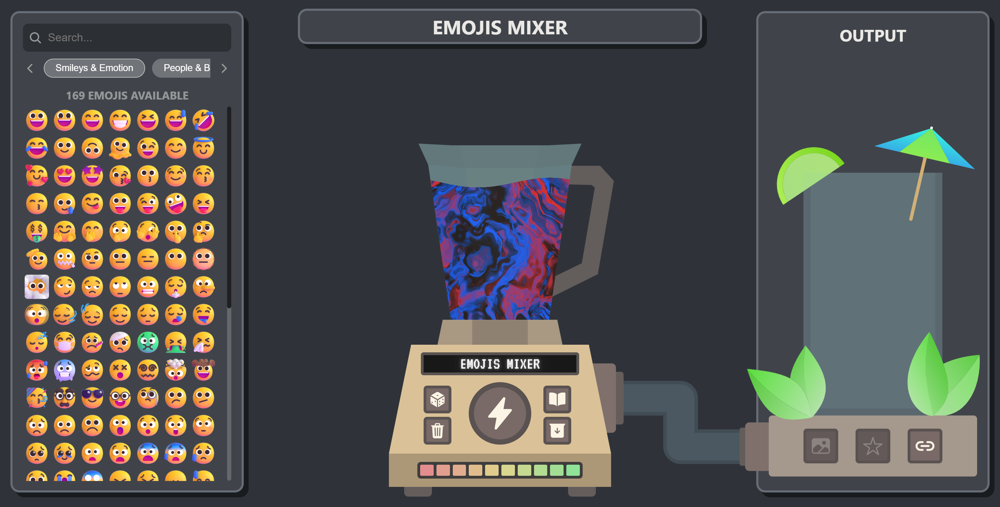
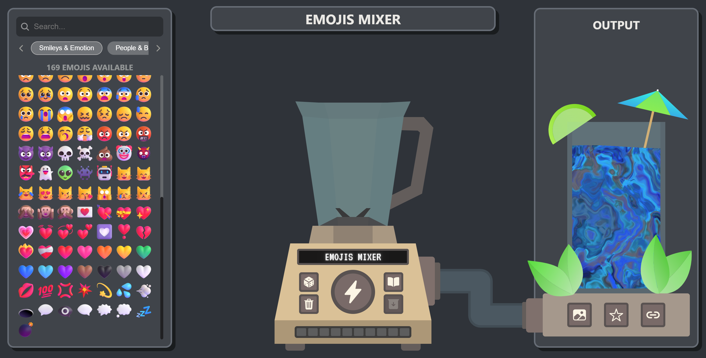
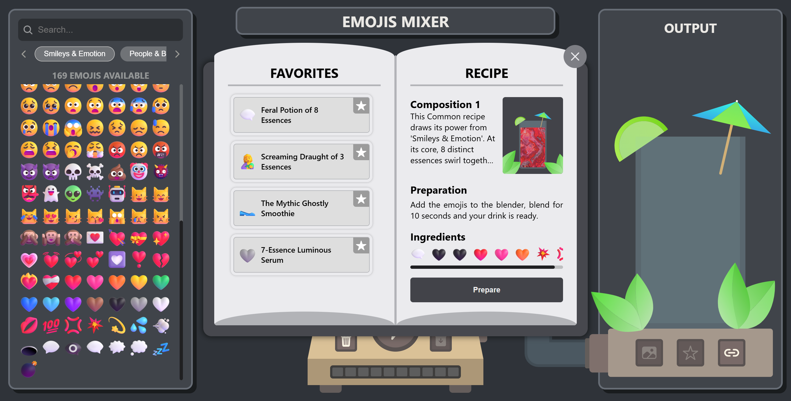
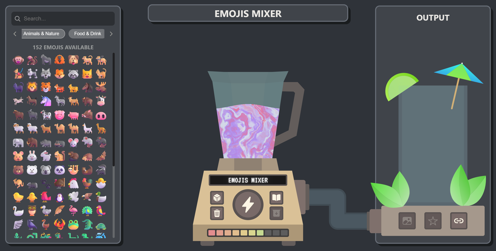

# Emojis Mixer

Choose your emojis, blend them together and create a unique drink based on your ingredients. Then save your best recipes in your book or share them with your friends.

## Test the website

You can try it out directly in your browser by clicking on the following link : [Emojis Mixer](https://capyblaze.github.io/EmojisMixer/)

## What is the project?

This is a web-based procedural art generator for drinks using emojis. You can throw any emojis into the blender’s container (they are subject to gravity) and blend them to transform them into a magnificent drink with a liquid marbling effect. You can then pour it into a glass and save the recipe in your recipe book.
This application is developed using React, TypeScript and Vite. Mapper.js is used for the physical simulation of the emojis, whilst the liquid rendering algorithm utilises Three.js with custom shaders.

## Why did you build it?

I wanted to recreate this effect in code ([Marble Liquid](https://www.vectorstock.com/royalty-free-vector/colorful-marble-texture-vector-18345291)) and I wanted something satisfying to use to achieve this result. Making a blender to create your own liquid marble drink was a good idea for this and using emojis as ingredients opens up a huge range of colour possibilities.

## Inspiration

This project draws its inspiration primarily from the visual effects of liquid marble art and the blending of coloured ingredients. The idea was to combine an abstract, fluid artistic aesthetic with a playful and satisfying user experience by transforming everyday symbols (emojis) into colour palettes.

## Theme

Theme selected: **Electroart**

This project falls under the 'Electroart' theme as it generates visual art using a range of emojis. An algorithm converts the emojis into colours and uses these colours to create an artistic pattern. As it is generated algorithmically, changing the emojis results in a different pattern. It is therefore possible to create an infinite number of different patterns (1595 emojis with between 1 and an infinite number of emojis per pattern).
The project is therefore a procedural visual art generator.

## How do I test it?

The quickest way to test it is to use the [Emojis Mixer](https://capyblaze.github.io/EmojisMixer/) website
If you want to run it locally on your computer, simply follow these steps

1. Clone this repository
   `git clone https://github.com/CapyBlaze/EmojisMixer.git`

2. Go into the project folder
   `cd EmojisMixer`

3. Install the dependencies
   `npm install`

4. Start the development server
   `npm run dev`

## Screenshots

|  |  |
| --------------------------------------- | --------------------------------------- |
|  |  |

## Demo Video

[Link to YouTube video demo](https://youtu.be/)
